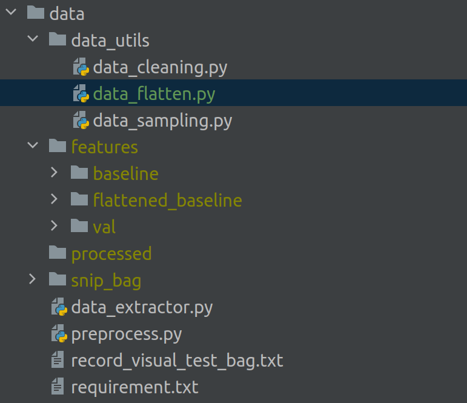

# Data Processing

## Data Path
* The processed data is saved in ```./data/features/[val, train, test, baseline]```
* Data frames read out from the bag are saved in ```./data/processed/```
* Original ros bags are saved in ```./data/snip_bag/```
## Usage
1. Generating features: 
```shell
# recommend to use the latest images
screen sudo docker run --volume /home/shengjie.wu:/home/shengjie.wu --volume /mnt/:/mnt --volume /crash/:/crash  \ 
--shm-size 1g -it c67e65a96d70 /bin/bash
# install python requirement
pip install -r ./data/requirement.txt
# run the data processing script
bash ./script/preproc.sh
```
2. Cleaning the dataset
```shell
# remove the damaged samples in-place
python ./data/data_utils/data_cleaning.py --path ./data/features/train/
```
3. Sampling the dataset
```shell
python ./data/data_utils/data_sampling.py --src data/features/train \
                                          --dst data/features/sampled_train \
                                          --interval 20
```
4. Split one sample into many samples conditioned on the origin selection.
```shell
python ./data/data_utils/data_flatten.py --src ./data/features/baseline/ \
                                         --dst ./data/features/flattened_baseline
```

# Train
```shell
bash ./scripts/train.sh
```

# Evaluation
```shell
# calculate the metrics for the agent whose observed position is used as orig.
python eval.py --val_path ./data/features/[val, baseline]/ \
               --viz \
               --mode ego     
```